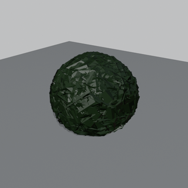
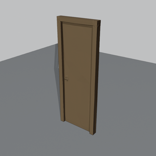
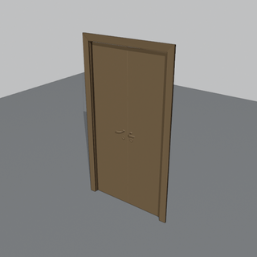
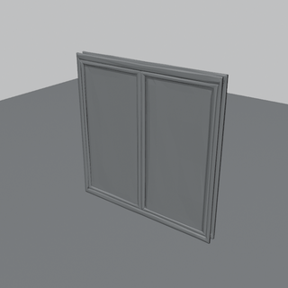
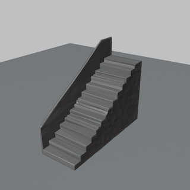
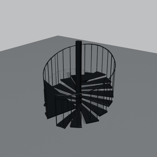

# Almond generated asset library

Open, redistributable 3D architectural assets for [Almond MCP](../README.md):
entourage, site furniture, building components, fixtures and unbranded
furniture placeholders. **33 assets**, all generated with
[Meshy](https://www.meshy.ai) from prompts written for this project and
normalised to real-world millimetres with an authored Almond spatial
contract. Unlike the IKEA / drawing libraries (3D Warehouse content that
each user downloads), these files ship with the repository.

- **License:** models and contracts are released under
  [CC BY 4.0](https://creativecommons.org/licenses/by/4.0/) - attribute as
  "Almond generated asset library (github.com/liangjunglj-cpu/almond-mcp)".
  Manifest, catalogue and tooling are MIT with the rest of the repo.
- **Units / axes:** millimetres; glTF Y-up in the file (Rhino's importer maps
  it to Z-up); bottom-centre at the origin; width = X, depth = Y (Rhino).
- **Materials:** one `ALMOND::<material_id>` material per asset so
  `import_asset_contract` / `place_generated_asset` restore the canonical
  Almond PBR values and `almond:*` metadata on import.
- **Dimensions are measured**, not nominal: the manifest records the real
  bounds of the normalised GLB (height is scaled exactly to the catalogue
  height; plan dimensions are whatever the generator produced, with the
  nominal target kept in `nominal_dimensions_mm` and the deviation in
  `plan_dimension_deviation`).

## Files

| Path | What |
| --- | --- |
| `catalogue.json` | Source of truth: asset ids, prompts, nominal sizes, material, clearances, generation recipe |
| `provenance.json` | Meshy task ids (concept image + mesh) and dates per asset |
| `manifest.json` | Generated by the build script; what the server indexes (schema 2.0, like the other libraries) |
| `models/<id>.glb` | Normalised mesh |
| `models/<id>.almond.json` | Asset contract (dimensions, anchor, clearances, material groups) |
| `raw/` | Raw Meshy downloads (gitignored) |
| `previews/` | 320 px renders per asset and per-group contact sheets (Blender workbench) |

## Using the library

```text
list_generated_assets(category="site_furniture")
search_generated_assets(query="tree", max_height_mm=8000)
get_generated_asset(asset_id="gen-street-lamp-1")
place_generated_asset(asset_id="gen-street-lamp-1", x_mm=0, y_mm=0)
```

`almond-mcp fetch-assets` downloads any missing GLB/contract from this
repository (wheel installs ship only the manifest); `--no-download` disables
that.

## Assets

Contact sheets: [entourage](previews/sheet-1-entourage.png) · [site furniture](previews/sheet-2-site-furniture.png) · [components](previews/sheet-3-components.png) · [fixtures](previews/sheet-4-fixtures.png) · [furniture](previews/sheet-5-furniture.png). Regenerate with `blender -b --python tools/render_generated_previews.py -- GeneratedAssetfiles/models <out>`.

| Preview | asset_id | Product | Category | W x D x H (mm) | Material | Triangles |
| --- | --- | --- | --- | --- | --- | --- |
|  `gen-person-standing-1` | Person standing (adult, casual clothing) | human_figure | 578 x 284 x 1750 | `plaster-white` | 4,383 |
|  `gen-person-walking-1` | Person walking (adult, mid-stride) | human_figure | 584 x 1032 x 1750 | `plaster-white` | 4,270 |
|  `gen-person-sitting-1` | Person sitting (adult, seated on a plain stool) | human_figure | 562 x 588 x 1300 | `plaster-white` | 4,153 |
|  `gen-tree-deciduous-medium-1` | Deciduous tree (medium, round crown) | vegetation | 4785 x 4949 x 7000 | `foliage-pine` | 4,063 |
|  `gen-tree-conifer-1` | Conifer tree (tall, narrow) | vegetation | 2452 x 2443 x 9000 | `foliage-pine` | 4,183 |
|  `gen-shrub-round-1` | Shrub (round clipped) | vegetation | 964 x 962 x 900 | `foliage-pine` | 2,499 |
|  `gen-car-sedan-1` | Car (generic mid-size sedan) | vehicle | 2057 x 5050 x 1450 | `steel-painted-charcoal` | 4,198 |
|  `gen-bicycle-1` | Bicycle (city bike) | vehicle | 560 x 1654 x 1050 | `steel-painted-charcoal` | 4,322 |
|  `gen-park-bench-1` | Park bench (timber slats, steel frame) | site_furniture | 1331 x 565 x 850 | `wood-oak` | 3,990 |
|  `gen-street-lamp-1` | Street lamp (single-arm LED) | site_furniture | 320 x 1441 x 4500 | `steel-painted-charcoal` | 3,979 |
|  `gen-bollard-1` | Bollard (cylindrical steel) | site_furniture | 191 x 189 x 900 | `steel-painted-charcoal` | 4,278 |
|  `gen-bike-rack-1` | Bike rack (inverted U hoop) | site_furniture | 553 x 36 x 800 | `steel-galvanized` | 4,179 |
|  `gen-litter-bin-1` | Litter bin (cylindrical public) | site_furniture | 491 x 490 x 1000 | `steel-painted-charcoal` | 4,402 |
|  `gen-door-single-1` | Single leaf door (flush leaf with frame and lever handle) | door | 819 x 149 x 2150 | `wood-oak` | 3,993 |
|  `gen-door-double-1` | Double leaf door (pair of flush leaves with frame) | door | 1222 x 155 x 2150 | `wood-oak` | 3,829 |
|  `gen-window-casement-1` | Casement window (two-light with frame) | window | 1500 x 107 x 1500 | `aluminium-anodized` | 4,320 |
|  `gen-stair-straight-1` | Straight stair flight (closed risers, one handrail) | stair | 1341 x 3710 x 3000 | `concrete-smooth` | 4,356 |
|  `gen-stair-spiral-1` | Spiral stair (central column, steel treads) | stair | 2842 x 2824 x 3000 | `steel-painted-charcoal` | 3,449 |
|  `gen-column-round-1` | Round column (plain concrete) | column | 454 x 457 x 3000 | `concrete-smooth` | 4,436 |
|  `gen-column-square-1` | Square column (plain concrete) | column | 472 x 497 x 3000 | `concrete-smooth` | 4,258 |
|  `gen-balustrade-glass-1` | Glass balustrade (frameless with steel handrail, 2 m segment) | railing | 1744 x 21 x 1100 | `glass-clear` | 4,026 |
|  `gen-toilet-1` | Toilet (close-coupled floor mounted) | sanitary | 448 x 670 x 800 | `ceramic-teal` | 4,216 |
|  `gen-washbasin-pedestal-1` | Washbasin (pedestal with mixer tap) | sanitary | 445 x 382 x 850 | `ceramic-teal` | 3,986 |
|  `gen-bathtub-1` | Bathtub (rectangular built-in) | sanitary | 1274 x 524 x 580 | `ceramic-teal` | 4,277 |
|  `gen-shower-enclosure-1` | Shower enclosure (square, glass, low tray) | sanitary | 1035 x 1035 x 2000 | `glass-clear` | 3,870 |
|  `gen-kitchen-range-1` | Kitchen range (freestanding cooker with oven) | appliance | 715 x 728 x 900 | `steel-galvanized` | 2,935 |
|  `gen-refrigerator-1` | Refrigerator (freestanding fridge-freezer) | appliance | 766 x 671 x 1800 | `steel-galvanized` | 1,016 |
|  `gen-sofa-3-seat-1` | Sofa (generic three-seat, fabric) | seating | 2346 x 983 x 850 | `rubber-black` | 4,087 |
|  `gen-dining-chair-1` | Dining chair (generic timber, armless) | seating | 462 x 566 x 900 | `wood-oak` | 4,337 |
|  `gen-office-chair-1` | Office chair (generic swivel task chair) | seating | 879 x 831 x 1100 | `rubber-black` | 4,101 |
|  `gen-dining-table-rect-1` | Dining table (generic rectangular, timber) | table | 1536 x 822 x 750 | `wood-oak` | 4,362 |
|  `gen-bed-double-1` | Double bed (generic platform bed with mattress and headboard) | bed | 2213 x 2289 x 950 | `wood-oak` | 4,353 |
|  `gen-desk-1` | Desk (generic writing desk, timber top, steel legs) | desk | 1306 x 656 x 750 | `wood-birch-ply` | 3,965 |

## Regenerating or extending

1. Add or edit an entry in `catalogue.json` (keep `asset_id` stable; bump the
   trailing number for a new variant).
2. Generate with Meshy following `generation_recipe` in the catalogue:
   `meshy_text_to_image` (nano-banana, prompt + `prompt_suffix`) then
   `meshy_image_to_3d` chained on that task (`meshy-t2`, `smart-topology`,
   `should_texture=false`, `target_formats=["glb"]`, `auto_size`, `origin_at=bottom`).
   About 8 credits per asset.
3. Save the GLB as `raw/<asset_id>.glb` and record both task ids in
   `provenance.json`.
4. Run `python tools/build_generated_assets.py` (optionally `--only <id>`),
   then `pytest tests/test_generated_assets.py`.
5. Note the change in `docs/licensing-audit.md` if the recipe or licence
   position changes.

Quality notes: meshes are untextured smart-topology output at roughly 4k
triangles - right for entourage, plans, sections and massing, not for
close-up renders. Plan-dimension deviations above 25% are flagged in the
build log; the measured values are what the manifest stores.
