# Almond generated asset library

Open, redistributable 3D architectural assets for [Almond MCP](../README.md):
entourage, site furniture, fixtures and unbranded
furniture placeholders. **50 assets**, all generated with
[Meshy](https://www.meshy.ai) from prompts written for this project and
normalised to real-world millimetres with an authored Almond spatial
contract. Unlike the IKEA / drawing libraries (3D Warehouse content that
each user downloads), these files ship with the repository.

- **License:** models are released under
  [CC BY 4.0](https://creativecommons.org/licenses/by/4.0/) - attribute as
  "Almond generated asset library (github.com/liangjunglj-cpu/almond-mcp)".
  Contracts, manifest, catalogue and tooling are MIT with the rest of the repo.
- **Units / axes:** millimetres; glTF Y-up in the file (Rhino's importer maps
  it to Z-up); bottom-centre at the origin; width = X, depth = Y (Rhino).
- **Materials:** one `ALMOND::<material_id>` material per asset so
  `import_asset_contract` / `place_generated_asset` restore the canonical
  Almond PBR values and `almond:*` metadata on import.
- **Dimensions are measured**, not nominal: the manifest records the real
  bounds of the normalised GLB (height is scaled exactly to the catalogue
  height; plan dimensions are whatever the generator produced, with the
  nominal target kept in `nominal_dimensions_mm` and the deviation in
  `plan_dimension_deviation`).

## Files

| Path | What |
| --- | --- |
| `catalogue.json` | Source of truth: asset ids, prompts, nominal sizes, material, clearances, generation recipe |
| `provenance.json` | Meshy task ids (concept image + mesh) and dates per asset |
| `manifest.json` | Generated by the build script; what the server indexes (schema 2.0, like the other libraries) |
| `models/<id>.glb` | Normalised mesh |
| `models/<id>.almond.json` | Asset contract (dimensions, anchor, clearances, material groups) |
| `raw/` | Raw Meshy downloads (gitignored) |
| `previews/` | 640 px material-colour archive thumbnails, render provenance and legacy contact sheets (Blender Workbench) |

## Using the library

```text
list_generated_assets(category="site_furniture")
search_generated_assets(query="tree", max_height_mm=8000)
get_generated_asset(asset_id="gen-street-lamp-1")
place_generated_asset(asset_id="gen-street-lamp-1", x_mm=0, y_mm=0)
```

Version 0.6 bundles all 50 models, contracts and previews in the wheel.
Run `almond-mcp audit-assets` to check checksums and agreement between embedded,
sidecar and manifest passports. Wheel installs use a versioned user-data pack;
explicit library directory overrides continue to take precedence.

## Embedded passports and reasoning tools

Each GLB contains `asset.extras.almond.passport`; nodes carry stable Almond
identity references. The same passport lives in the `.almond.json` contract
and the manifest, validated against `passport.schema.json`. It records
measured and nominal dimensions separately, source prompts and Meshy task ids,
materials, clearances, support plane, usage suggestions, quality caveats and
attribution. Suggested rooms are category/label heuristics, not audited facts.

```text
recommend_generated_assets(query="bench", width_mm=2400, depth_mm=1600)
get_generated_asset_passport(asset_id="gen-park-bench-1")
evaluate_generated_asset_fit(asset_id="gen-park-bench-1", width_mm=2400, depth_mm=1600)
```

Read `almond://generated/catalogue` and the per-asset `/passport` and `/preview`
resources from an MCP client. Clearances are authored design allowances;
rectangular fit does not check actual room obstacles or certify accessibility.
Existing geometry remains unchanged. These legacy GLBs contain numeric mm,
so a generic metre-based glTF viewer needs a 0.001 scale conversion; Almond's
existing Rhino placement uses its millimetre contract.

Run `python tools/enrich_generated_assets.py` to refresh passports on existing
normalised models. The normalisation builder also embeds passports for new
models. `almond-mcp audit-assets` verifies the result.

## Assets

Contact sheets: [entourage](previews/sheet-1-entourage.png) · [site furniture](previews/sheet-2-site-furniture.png) · [components](previews/sheet-3-components.png) · [fixtures](previews/sheet-4-fixtures.png) · [furniture](previews/sheet-5-furniture.png) · [lighting](previews/sheet-6-lighting.png). Regenerate with `blender -b --python tools/render_generated_previews.py -- GeneratedAssetfiles/models <out>`.

| Preview | asset_id | Product | Category | W x D x H (mm) | Material | Triangles |
| --- | --- | --- | --- | --- | --- | --- |
| 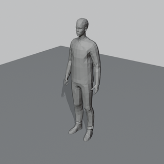 | `gen-person-standing-1` | Person standing (adult, casual clothing) | human_figure | 578 x 284 x 1750 | `plaster-white` | 4,383 |
| 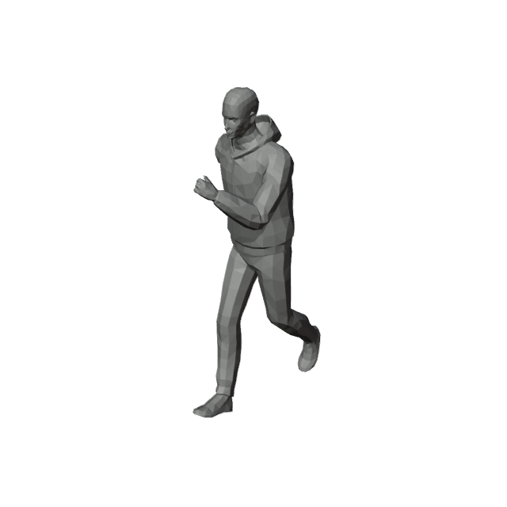 | `gen-person-walking-1` | Person walking (adult, mid-stride) | human_figure | 584 x 1032 x 1750 | `plaster-white` | 4,270 |
| 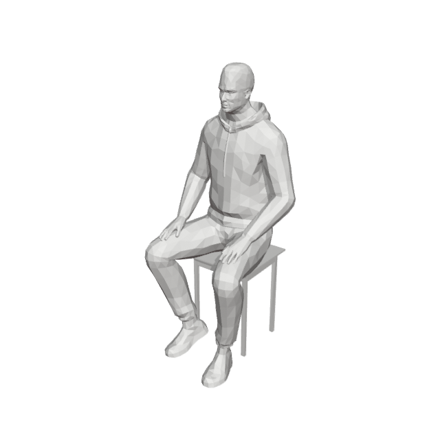 | `gen-person-sitting-1` | Person sitting (adult, seated on a plain stool) | human_figure | 562 x 588 x 1300 | `plaster-white` | 4,153 |
| 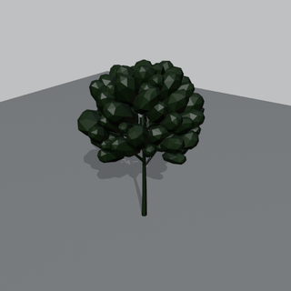 | `gen-tree-deciduous-medium-1` | Deciduous tree (medium, round crown) | vegetation | 5207 x 4884 x 7000 | `foliage-pine` | 80,000 |
| 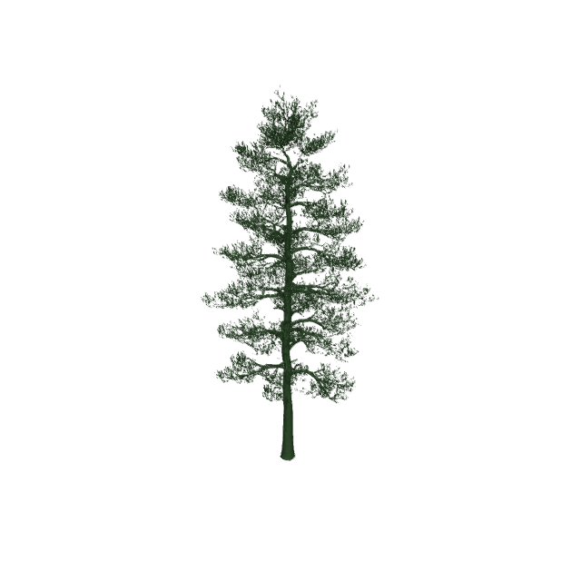 | `gen-tree-conifer-1` | Conifer tree (tall, narrow) | vegetation | 3837 x 3717 x 9000 | `foliage-pine` | 80,000 |
| 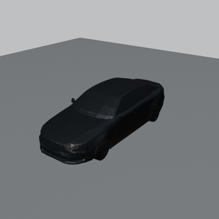 | `gen-car-sedan-1` | Car (generic mid-size sedan) | vehicle | 2057 x 5050 x 1450 | `steel-painted-charcoal` | 4,198 |
| 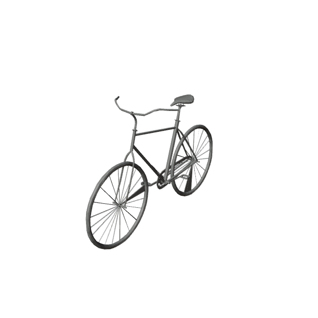 | `gen-bicycle-1` | Bicycle (city bike) | vehicle | 560 x 1654 x 1050 | `steel-painted-charcoal` | 4,322 |
| 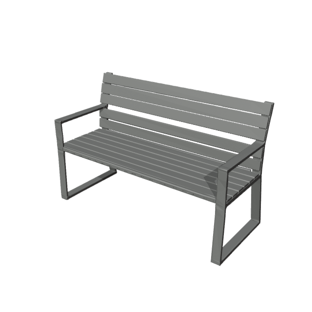 | `gen-park-bench-1` | Park bench (timber slats, steel frame) | site_furniture | 1331 x 565 x 850 | `wood-oak` | 3,990 |
| 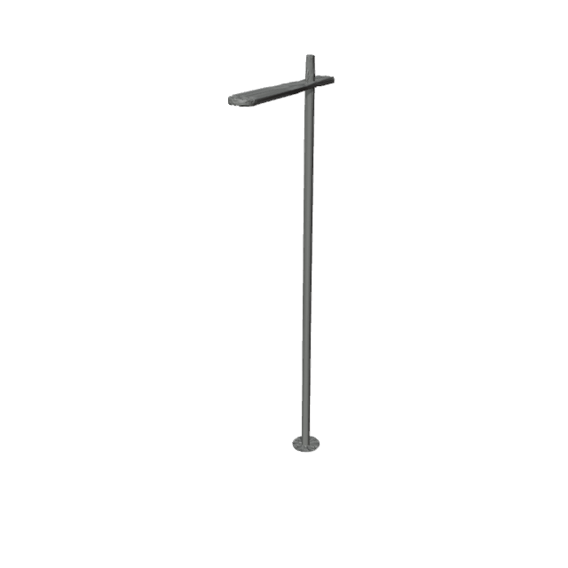 | `gen-street-lamp-1` | Street lamp (single-arm LED) | site_furniture | 320 x 1441 x 4500 | `steel-painted-charcoal` | 3,979 |
| 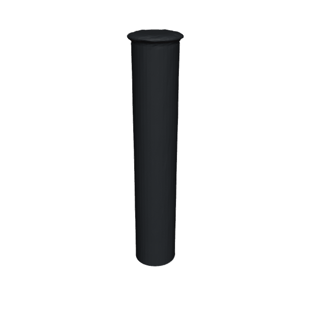 | `gen-bollard-1` | Bollard (cylindrical steel) | site_furniture | 191 x 189 x 900 | `steel-painted-charcoal` | 4,278 |
| 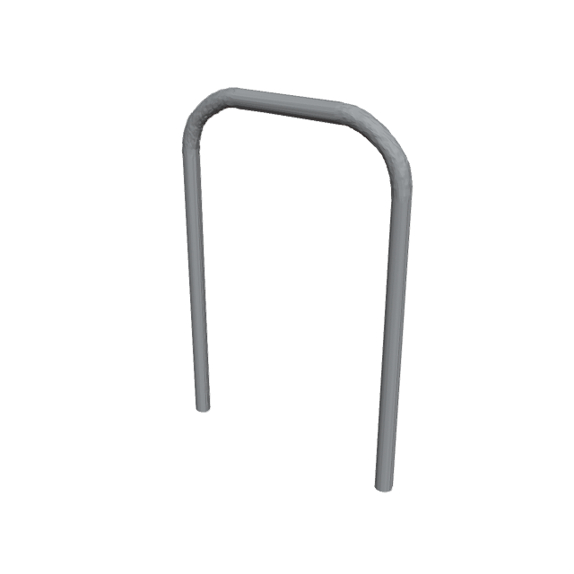 | `gen-bike-rack-1` | Bike rack (inverted U hoop) | site_furniture | 553 x 36 x 800 | `steel-galvanized` | 4,179 |
| 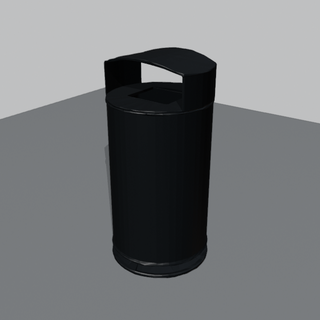 | `gen-litter-bin-1` | Litter bin (cylindrical public) | site_furniture | 491 x 490 x 1000 | `steel-painted-charcoal` | 4,402 |
| 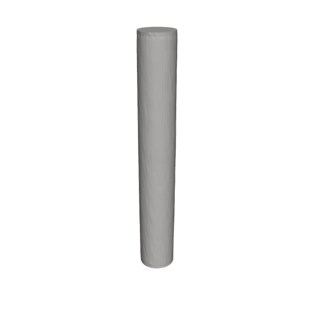 | `gen-column-round-1` | Round column (plain concrete) | column | 454 x 457 x 3000 | `concrete-smooth` | 4,436 |
| 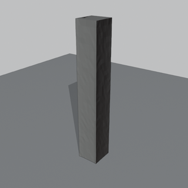 | `gen-column-square-1` | Square column (plain concrete) | column | 472 x 497 x 3000 | `concrete-smooth` | 4,258 |
| 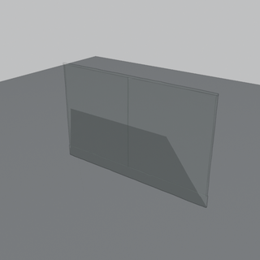 | `gen-balustrade-glass-1` | Glass balustrade (frameless with steel handrail, 2 m segment) | railing | 1744 x 21 x 1100 | `glass-clear` | 4,026 |
| 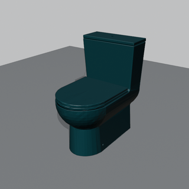 | `gen-toilet-1` | Toilet (close-coupled floor mounted) | sanitary | 448 x 670 x 800 | `ceramic-teal` | 4,216 |
| 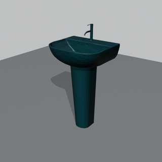 | `gen-washbasin-pedestal-1` | Washbasin (pedestal with mixer tap) | sanitary | 445 x 382 x 850 | `ceramic-teal` | 3,986 |
| 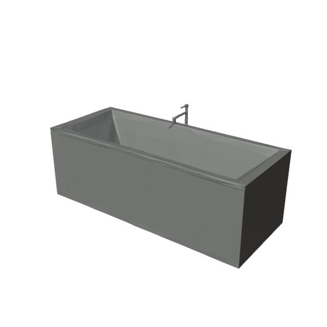 | `gen-bathtub-1` | Bathtub (rectangular built-in) | sanitary | 1274 x 524 x 580 | `ceramic-teal` | 4,277 |
| 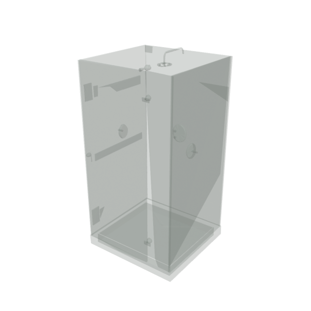 | `gen-shower-enclosure-1` | Shower enclosure (square, glass, low tray) | sanitary | 1035 x 1035 x 2000 | `glass-clear` | 3,870 |
| 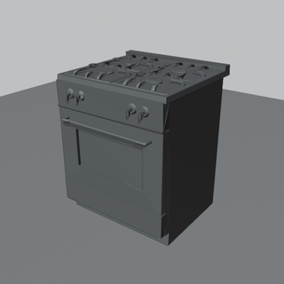 | `gen-kitchen-range-1` | Kitchen range (freestanding cooker with oven) | appliance | 715 x 728 x 900 | `steel-galvanized` | 2,935 |
| 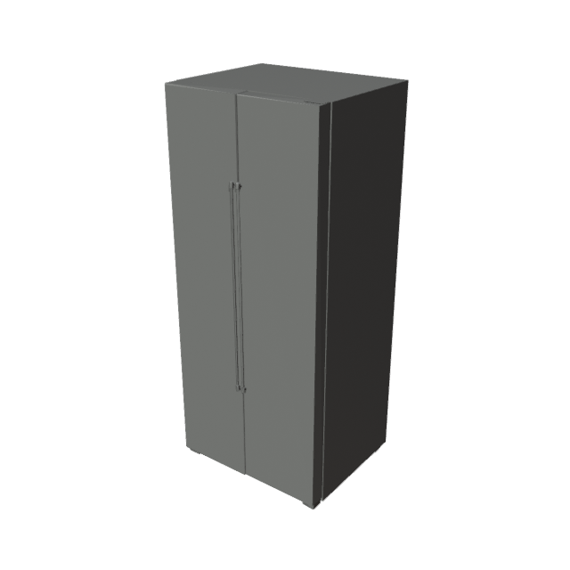 | `gen-refrigerator-1` | Refrigerator (freestanding fridge-freezer) | appliance | 766 x 671 x 1800 | `steel-galvanized` | 1,016 |
| 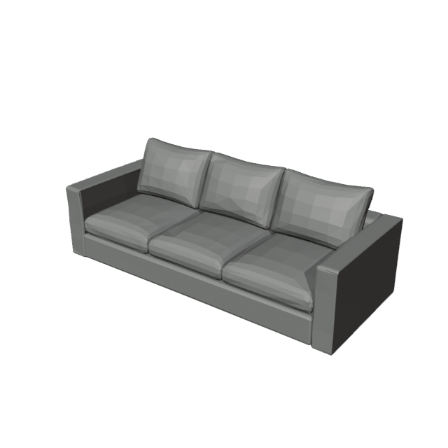 | `gen-sofa-3-seat-1` | Sofa (generic three-seat, fabric) | seating | 2346 x 983 x 850 | `rubber-black` | 4,087 |
| 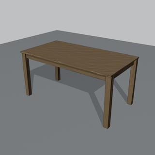 | `gen-dining-table-rect-1` | Dining table (generic rectangular, timber) | table | 1536 x 822 x 750 | `wood-oak` | 4,362 |
| 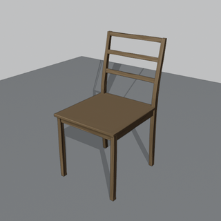 | `gen-dining-chair-1` | Dining chair (generic timber, armless) | seating | 462 x 566 x 900 | `wood-oak` | 4,337 |
| 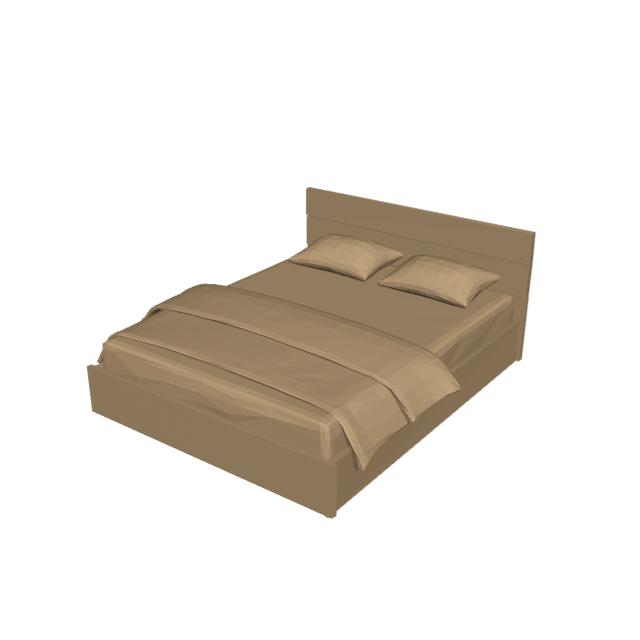 | `gen-bed-double-1` | Double bed (generic platform bed with mattress and headboard) | bed | 2213 x 2289 x 950 | `wood-oak` | 4,353 |
| 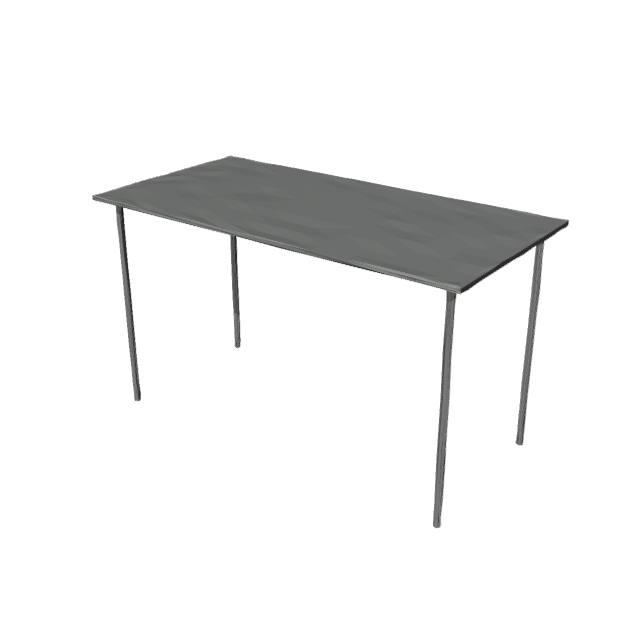 | `gen-desk-1` | Desk (generic writing desk, timber top, steel legs) | desk | 1306 x 656 x 750 | `wood-birch-ply` | 3,965 |
| 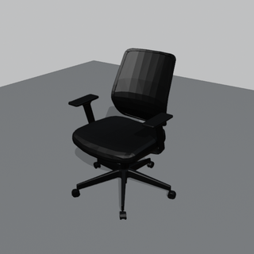 | `gen-office-chair-1` | Office chair (generic swivel task chair) | seating | 879 x 831 x 1100 | `rubber-black` | 4,101 |
| 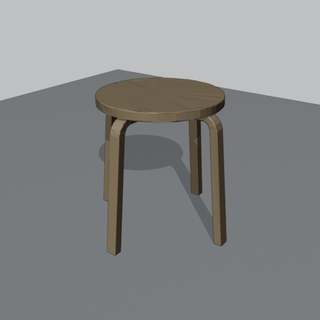 | `gen-stool-bent-birch-3leg-1` | Stool (three-legged bent-birch stool, round seat) | seating | 489 x 489 x 440 | `wood-birch-ply` | 4,125 |
| 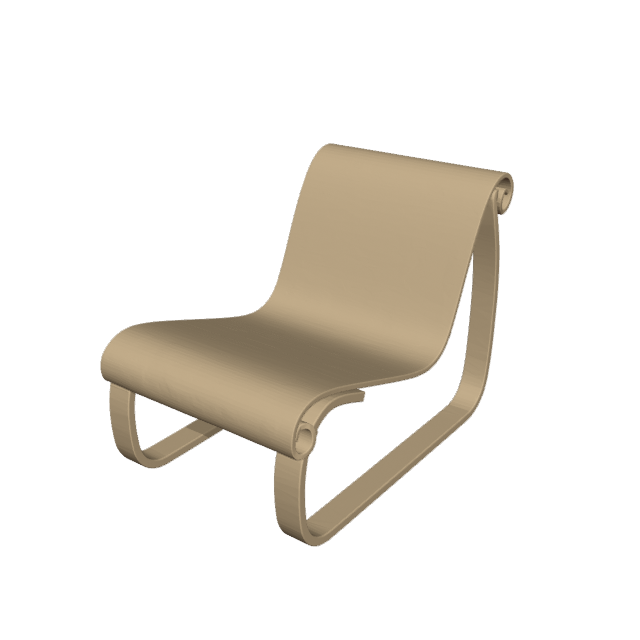 | `gen-lounge-chair-bent-plywood-1` | Lounge chair (cantilevered bent-plywood lounge chair, scroll seat) | seating | 565 x 911 x 640 | `wood-birch-ply` | 79,999 |
| 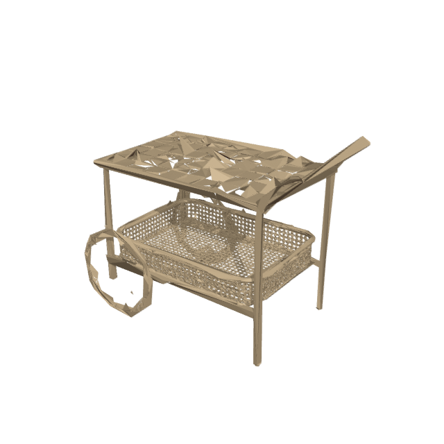 | `gen-tea-trolley-bent-birch-1` | Tea trolley (bent-birch frame, two large plywood wheels, rattan basket) | table | 771 x 490 x 600 | `wood-birch-ply` | 110,854 |
| 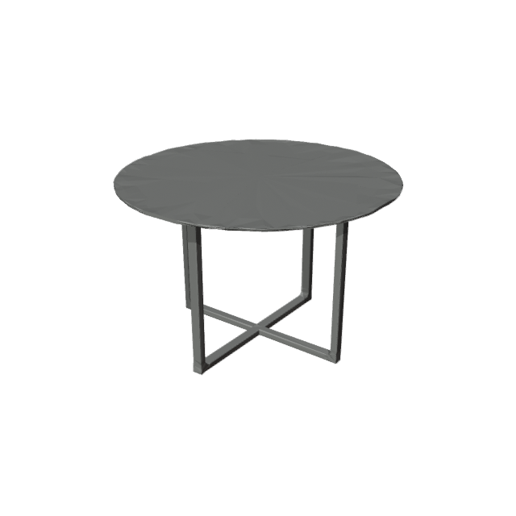 | `gen-dining-table-round-birch-1` | Dining table (round white laminate top on four bent-birch L-legs) | table | 1117 x 1117 x 720 | `wood-birch-ply` | 4,288 |
| 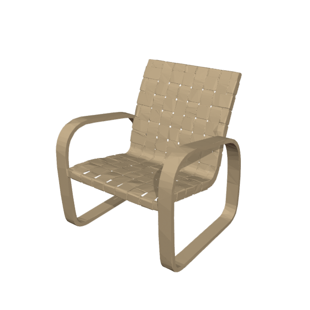 | `gen-armchair-bent-birch-webbed-1` | Armchair (bent-birch frame with linen webbing seat and back) | seating | 688 x 704 x 800 | `wood-birch-ply` | 79,977 |
| 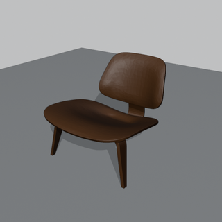 | `gen-lounge-chair-molded-plywood-1` | Lounge chair (moulded plywood lounge chair, low, wood legs) | seating | 732 x 831 x 680 | `wood-walnut` | 79,996 |
| 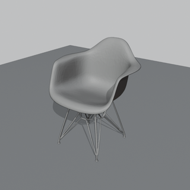 | `gen-side-chair-shell-wire-base-1` | Side chair (moulded shell seat on wire tower base) | seating | 659 x 595 x 800 | `plaster-white` | 80,000 |
| 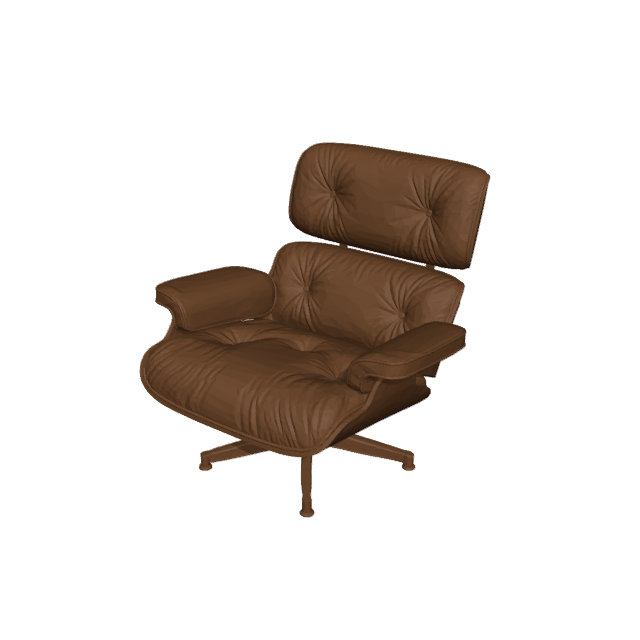 | `gen-lounge-chair-leather-plywood-1` | Lounge chair (leather lounge chair, three bent plywood shells, swivel base) | seating | 882 x 899 x 840 | `wood-walnut` | 79,998 |
| 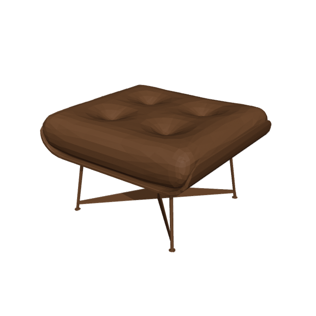 | `gen-ottoman-leather-plywood-1` | Ottoman (matching leather ottoman on aluminium base) | seating | 703 x 653 x 430 | `wood-walnut` | 3,976 |
| 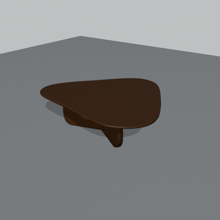 | `gen-coffee-table-freeform-glass-1` | Coffee table (freeform glass top on two-piece sculptural wood base) | table | 1439 x 1274 x 400 | `wood-walnut` | 57,260 |
| 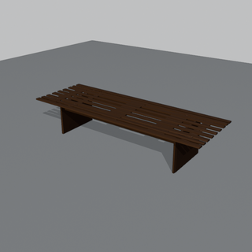 | `gen-bench-slatted-platform-1` | Bench (slatted wood platform bench on ebonised frame) | seating | 1800 x 624 x 355 | `wood-walnut` | 3,581 |
| 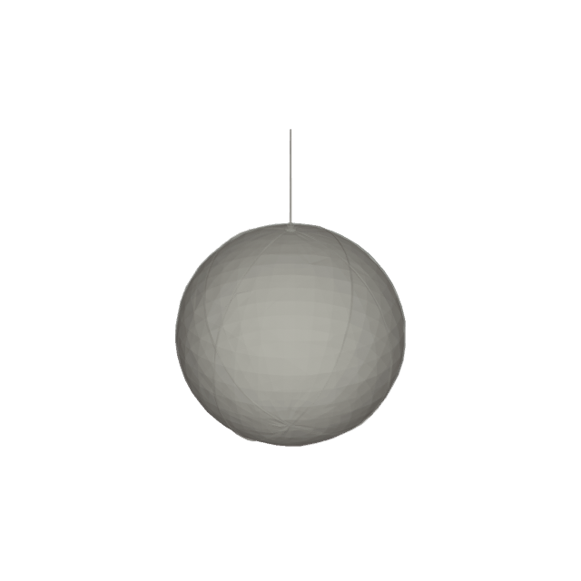 | `gen-pendant-lamp-sphere-1` | Pendant lamp (spherical white pendant, spun web shade) | lighting | 474 x 471 x 640 | `polycarbonate-opal` | 4,153 |
| 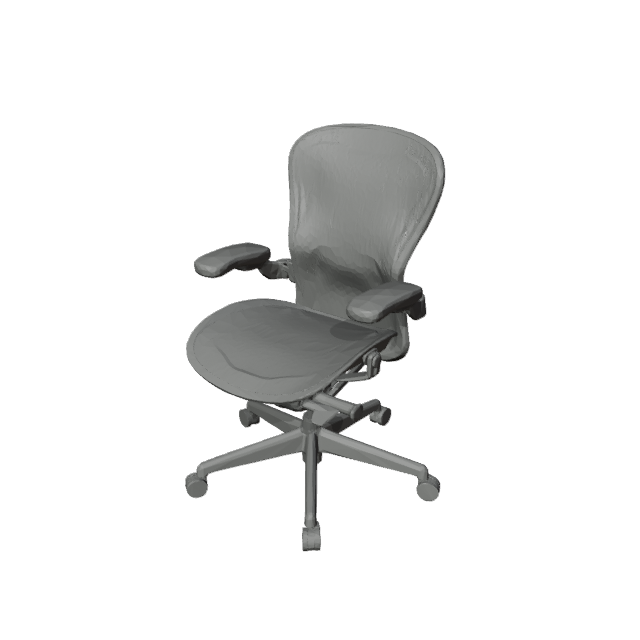 | `gen-task-chair-mesh-ergonomic-1` | Office chair (ergonomic mesh task chair, adjustable arms) | seating | 823 x 804 x 1080 | `rubber-black` | 79,997 |
| 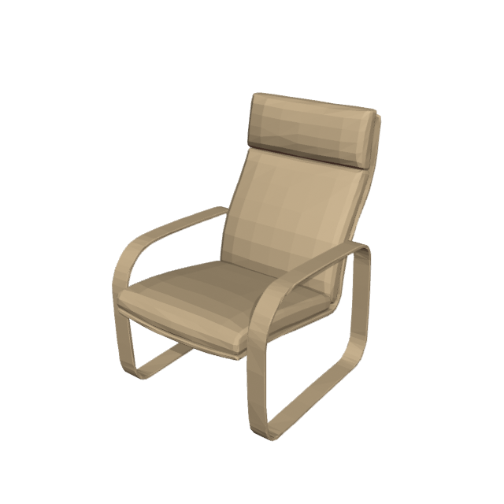 | `gen-armchair-cantilever-bentwood-1` | Armchair (cantilevered bent-wood armchair with thick cushion) | seating | 691 x 912 x 1000 | `wood-birch-ply` | 4,368 |
| 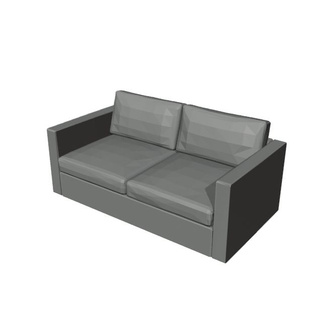 | `gen-sofa-2-seat-loose-cover-1` | Sofa (boxy two-seat sofa with loose fabric cover) | seating | 1405 x 752 x 660 | `rubber-black` | 4,301 |
| 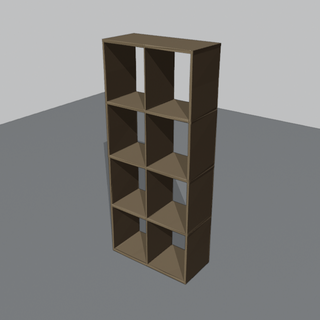 | `gen-shelving-cube-2x4-1` | Shelving unit (open cube shelving, 2 by 4) | storage | 626 x 293 x 1470 | `wood-birch-ply` | 4,203 |
| 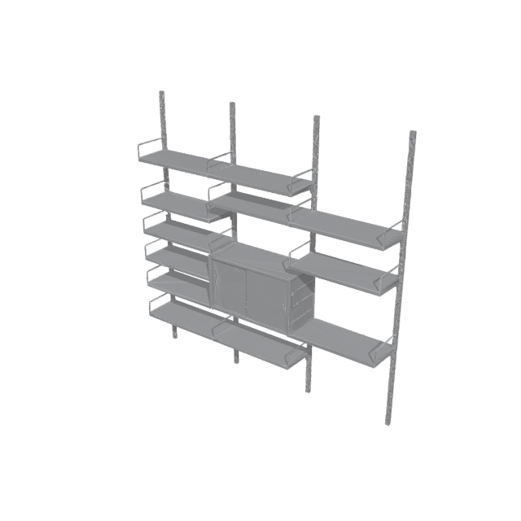 | `gen-shelving-modular-track-1` | Shelving system (wall-mounted modular shelving on aluminium tracks) | storage | 1966 x 313 x 2000 | `aluminium-anodized` | 79,999 |
| 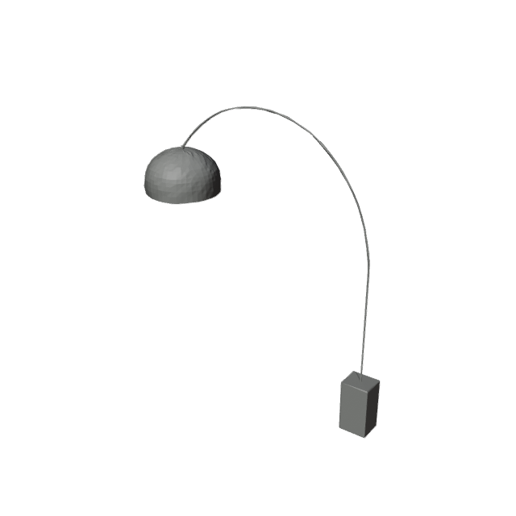 | `gen-floor-lamp-arc-1` | Floor lamp (arc floor lamp on a marble base) | lighting | 2180 x 621 x 2400 | `steel-galvanized` | 4,271 |
| 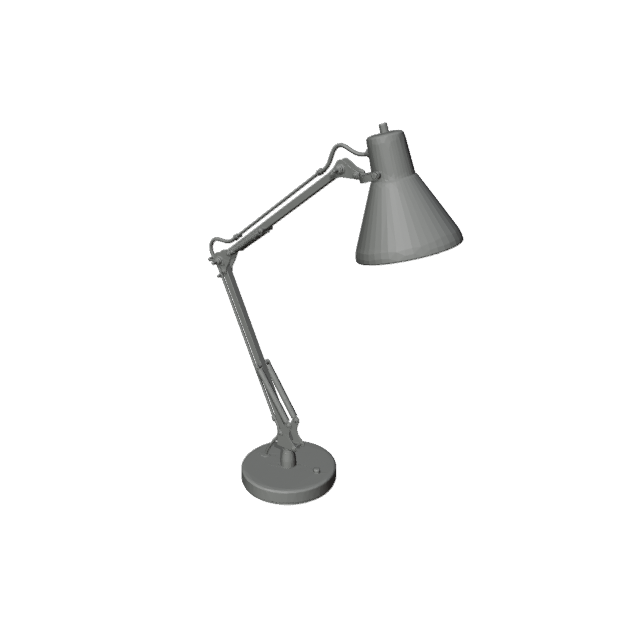 | `gen-task-lamp-balanced-arm-1` | Task lamp (two-arm balanced desk lamp) | lighting | 321 x 116 x 450 | `aluminium-anodized` | 80,000 |
| 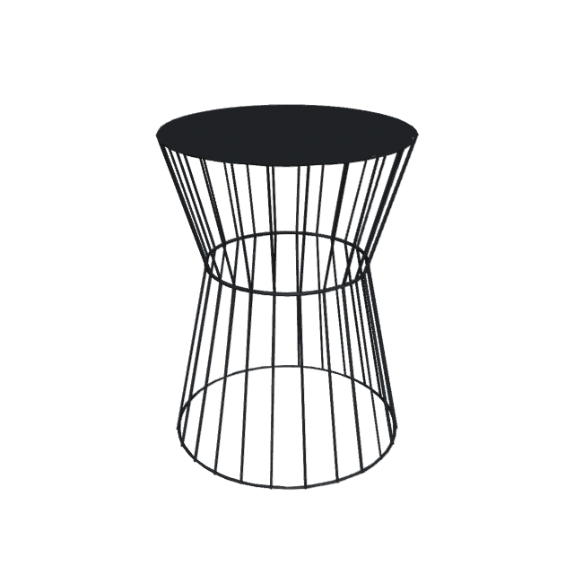 | `gen-side-table-wire-1` | Side table (stacking wire side table) | table | 378 x 378 x 500 | `steel-painted-charcoal` | 4,235 |

## Batch 2: design-idiom furniture and lighting

The second batch (ids with `batch: 2` in the catalogue) describes design language
rather than products: Scandinavian bent birch, American mid-century moulded
plywood and shell seating, democratic-design staples, Italian lighting. Prompts
never name a brand or product and ids stay generic, so the CC BY 4.0 release is
clean; treat them as placeholders in the idiom, not replicas. Concept images came
from Higgsfield (nano_banana); meshes from Meshy, with the complex pieces on
Meshy 7 ultra and decimated to about 80k triangles.

## Regenerating or extending

1. Add or edit an entry in `catalogue.json` (keep `asset_id` stable; bump the
   trailing number for a new variant).
2. Generate with Meshy following `generation_recipe` in the catalogue:
   `meshy_text_to_image` (nano-banana, prompt + `prompt_suffix`) then
   `meshy_image_to_3d` chained on that task (`meshy-t2`, `smart-topology`,
   `should_texture=false`, `target_formats=["glb"]`, `auto_size`, `origin_at=bottom`).
   About 8 credits per asset.
3. Save the GLB as `raw/<asset_id>.glb` and record both task ids in
   `provenance.json`.
4. Run `python tools/build_generated_assets.py` (optionally `--only <id>`),
   then `pytest tests/test_generated_assets.py`.
5. Note the change in `docs/licensing-audit.md` if the recipe or licence
   position changes.

Quality notes: most meshes are untextured smart-topology output at roughly 4k
triangles; the two trees are meshy-7 ultra output decimated to 80k triangles (see
`tools/decimate_glb.py`) - right for entourage, plans, sections and massing, not for
close-up renders. Plan-dimension deviations above 25% are flagged in the
build log; the measured values are what the manifest stores.

### Coloured archive previews (rc.8)

The 47 individual thumbnails now use the embedded GLB material base colours,
with paint.sl studio lighting and a transparent background. They are material
studies, not photographic textures or full PBR renders. Model geometry,
materials, embedded passports and derived drawings are unchanged. Existing
contact sheets are legacy renders.

Regenerate with `blender --factory-startup -b --python tools/render_generated_previews.py -- GeneratedAssetfiles/models GeneratedAssetfiles/previews --archive`.
`--clay` is an optional neutral study; `--asset <asset_id>` renders a single
inspection sample into a separate output folder. The full archive needs all
50 records. `previews/render-record.json` records Blender/version/settings,
script checksum (LF-normalized), and each source GLB and rendered PNG checksum.
This is a post-generation preview derivation, not a change to Meshy history.

## Organic detail batch (rc.12)

Three approved neutral assets cover forms that are inconvenient to build from
primitives: a weathered boulder, driftwood and a loosely folded throw. The public collection contains geometry
editions with Almond material colours, not photographic texture atlases.

The batch uses Meshy's nano-banana-pro reference images and Meshy 7.1 standard
generation at 4k geometry resolution, with provider remeshing disabled. Dense
source GLBs remain in the local, gitignored `raw/organic-2026-09/` directory.
Blender derives library versions targeting 80k–120k triangles without
subdivision. Select **Original** in Rhino to place that full library mesh;
**Light** remains an optional 20k placement target.

`batches/organic-2026-09.json` preserves the original prompts and requested
settings. Per-asset records and retained generated input images live under
`batches/organic-2026-09/`. Embedded passports retain task IDs, timestamps,
input/output hashes, actual triangle counts and derivation/topology checks.
Unknown seeds remain null. No external design images were submitted. Heights
are authored study sizes; dimensions are not product specifications. Foliage
is generic entourage, not a certified botanical reconstruction.

Quality records report boundary and non-manifold edges, zero-area faces,
connected components and bounds changes. Visual inspection complements these
checks; self-intersections and fabrication suitability are not certified.

Five concepts were attempted in this batch. Only the three reviewed assets above
are included. The broad-frond plant failed the mesh/visual quality review; the
grass task was still processing at selection cutoff. Their trial files remain
in the local raw directory and are not part of the public pack.
