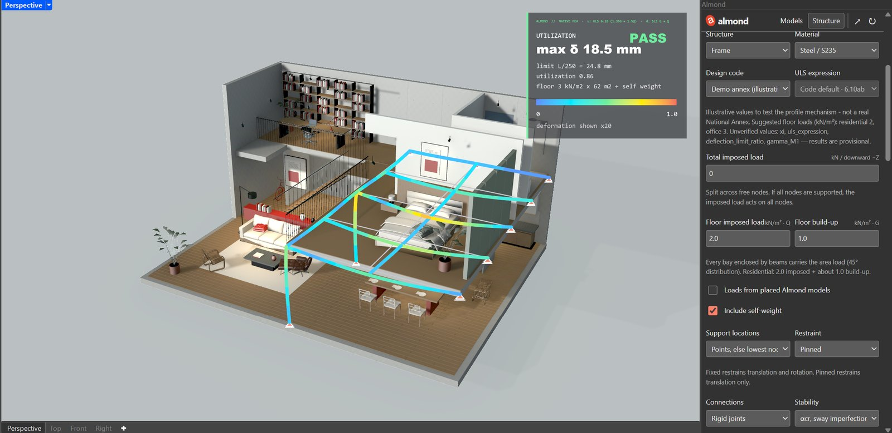
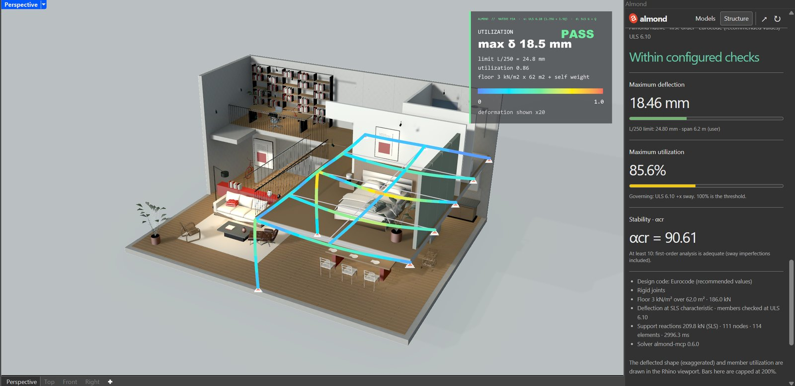
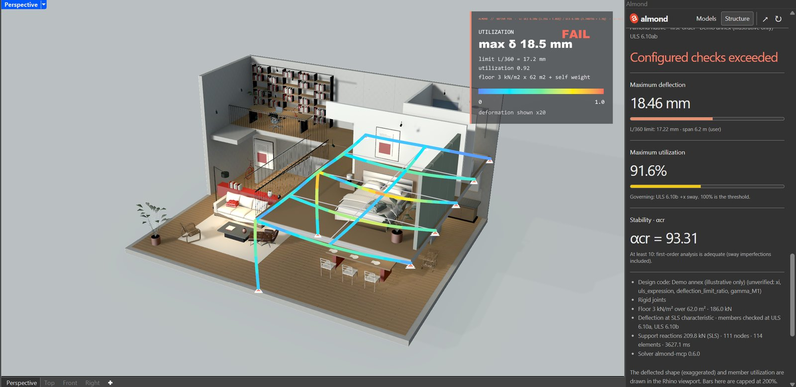

# Design code profiles

Almond's native structural engine follows the Eurocode method: EN 1990 load combinations and the
EN 1993-1-1 stability and member checks. Where the Eurocodes leave a number to each country
(a *Nationally Determined Parameter*, set in that country's National Annex), Almond reads it from a
**design code profile** instead of from its source code.

- **`eurocode`** (built in, the default): the values the Eurocodes recommend, with no National Annex.
- **`off`** (built in): no design code. Characteristic G + Q, no partial factors, a span/250 screen.
  Useful for comparisons (it matches the Karamba route's basis), not for design.
- **Your own profiles**: one JSON file per National Annex (or office standard) in
  `%LOCALAPPDATA%\Almond\design-codes\` (or the folder named by `ALMOND_DESIGN_CODE_DIR`).

Choose the profile under **Design code** in the panel (step 02), or pass `design_code` to
`validate_structure` / `visualize_structure` (`list_design_codes` lists them). Every result states
the profile, the values it used and any value that is not yet verified.

The same frame (A07 mezzanine, CHS 219.1x8, 2.0 + 1.0 kN/m2 floor load, rigid joints) under three
profiles: Eurocode passes (18.46 mm against span/250, 85.6 %); an illustrative annex with span/360,
gamma_M1 = 1.1 and 6.10a/b fails on deflection (limit 17.22 mm) at 91.6 %, its unverified values
flagged; Off gives 59.5 % unfactored.





## What a profile sets

| Parameter | Meaning | Eurocode recommended value | Clause |
|---|---|---|---|
| `gamma_G` | Partial factor, unfavourable permanent actions | 1.35 | EN 1990 Table A1.2(B) |
| `gamma_Q` | Partial factor, leading variable action | 1.5 | EN 1990 Table A1.2(B) |
| `psi_0` | Combination factor for imposed loads (used in 6.10a) | 0.7 | EN 1990 Table A1.1 |
| `xi` | Reduction of permanent actions in 6.10b | 0.85 | EN 1990 Table A1.2(B) |
| `uls_expression` | `"either"` (the user chooses), `"6.10"` or `"6.10ab"` (prescribed) | either | EN 1990 6.4.3.2(3) |
| `uls_default` | Expression used when the user does not choose | 6.10 | — |
| `deflection_limit_ratio` | Deflection limit = span / ratio | 250 (indicative) | EN 1990 A1.4 (left to NA / project) |
| `gamma_M0` | Resistance of cross-sections | 1.0 | EN 1993-1-1 6.1 |
| `gamma_M1` | Resistance of members to instability | 1.0 | EN 1993-1-1 6.1 |
| `imposed_floor_kn_m2` | Suggested imposed floor loads by use (shown in the panel; optional) | A 2.0, B 3.0 | EN 1991-1-1 Table 6.2 |

Fixed by the Eurocode itself, the same in every country and therefore not in a profile: the
1/200 basic sway imperfection (EN 1993-1-1 5.3.2), the α_cr ≥ 10 first-order threshold (5.2.1),
the buckling curves (Table 6.2) and material densities.

## Writing a profile

Copy this template, give it your own `id`, and fill in every value **from the published National
Annex**. Every parameter needs a `source` (document and clause). Set `"verified": true` only after
someone has checked the value against the document; unverified values work, but every result that
uses them says so.

```json
{
  "schema_version": 1,
  "id": "sg",
  "name": "Singapore (SS EN + National Annexes)",
  "basis": "SS EN 1990 + NA, SS EN 1991-1-1 + NA, SS EN 1993-1-1 + NA",
  "parameters": {
    "gamma_G": {"value": 1.35, "source": "NA to SS EN 1990, Table NA.A1.2(B)", "verified": false},
    "gamma_Q": {"value": 1.5, "source": "NA to SS EN 1990, Table NA.A1.2(B)", "verified": false},
    "psi_0": {"value": 0.7, "source": "NA to SS EN 1990, Table NA.A1.1", "verified": false},
    "xi": {"value": 0.85, "source": "NA to SS EN 1990, Table NA.A1.2(B)", "verified": false},
    "uls_expression": {"value": "either", "source": "NA to SS EN 1990, 6.4.3.2(3)", "verified": false},
    "uls_default": {"value": "6.10", "source": "office choice", "verified": false},
    "deflection_limit_ratio": {"value": 250, "source": "NA to SS EN 1993-1-1, 7.2 / project", "verified": false},
    "gamma_M0": {"value": 1.0, "source": "NA to SS EN 1993-1-1, 6.1(1)", "verified": false},
    "gamma_M1": {"value": 1.0, "source": "NA to SS EN 1993-1-1, 6.1(1)", "verified": false},
    "imposed_floor_kn_m2": {"value": {"A_residential": 1.5}, "source": "NA to SS EN 1991-1-1, Table NA.2", "verified": false}
  }
}
```

The numbers in this template are **placeholders copied from the Eurocode defaults**: they are not
Singapore's values. Replace each one from the annex before relying on the profile.

Check a profile with:

```bash
uvx almond-mcp design-codes
```

It lists every profile and explains any file it rejected (unknown parameter, value out of range,
missing source, duplicate id). Built-in ids (`eurocode`, `off`) cannot be replaced.

## Limits

A profile changes numbers, not methods. It cannot turn the Eurocode checks into another code
family's (AISC/ASCE 7, AS 4100): those use different formulas and would need their own check
module. Loads Almond does not calculate yet (wind, snow, seismic) are not covered by any profile.
Timber, concrete and aluminium results stay indicative whatever the profile: their own Eurocodes
(EN 1995, EN 1992, EN 1999) are not applied.
