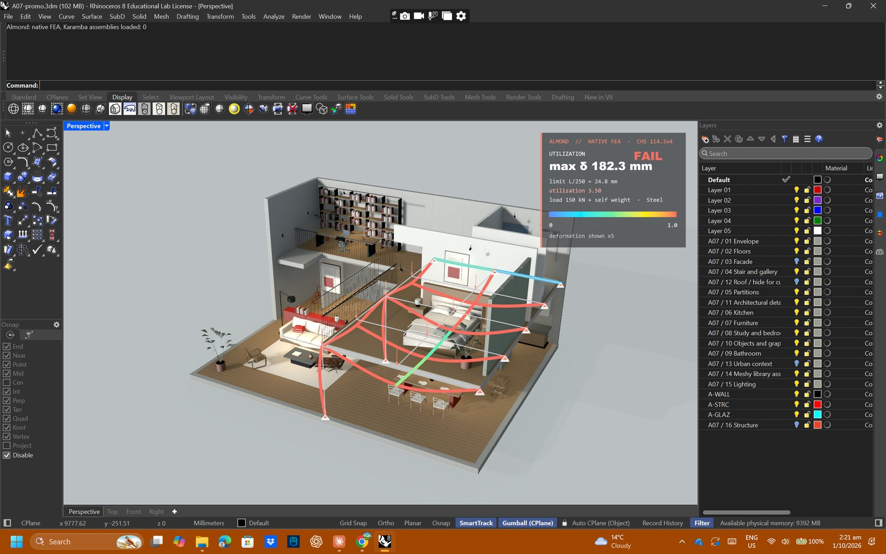
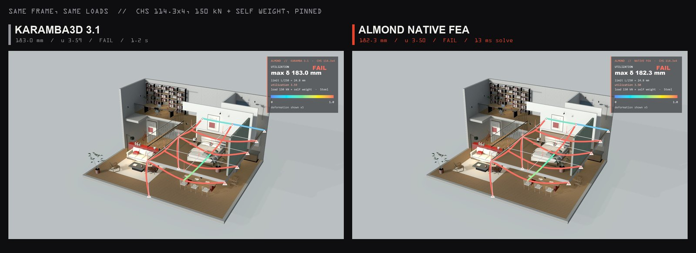
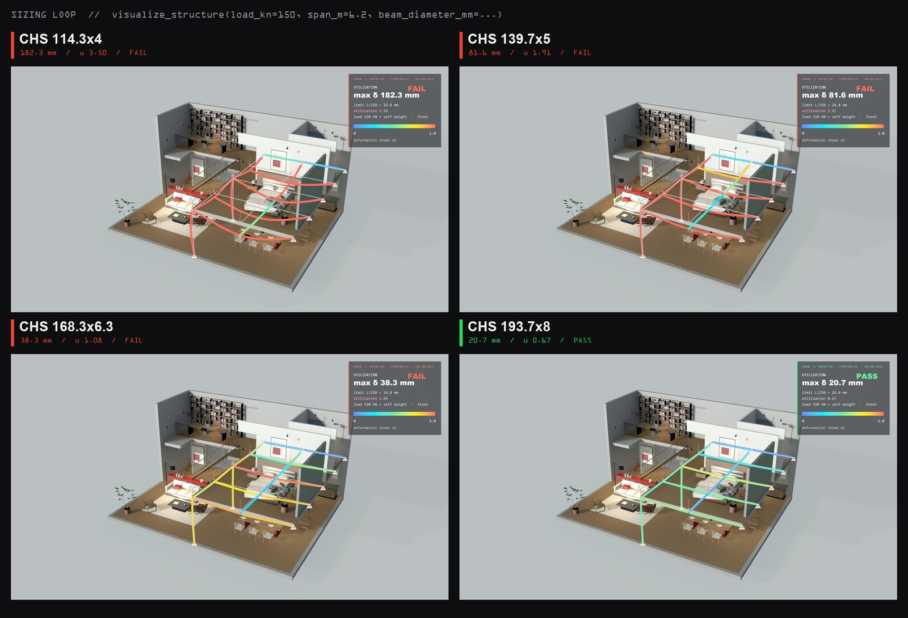
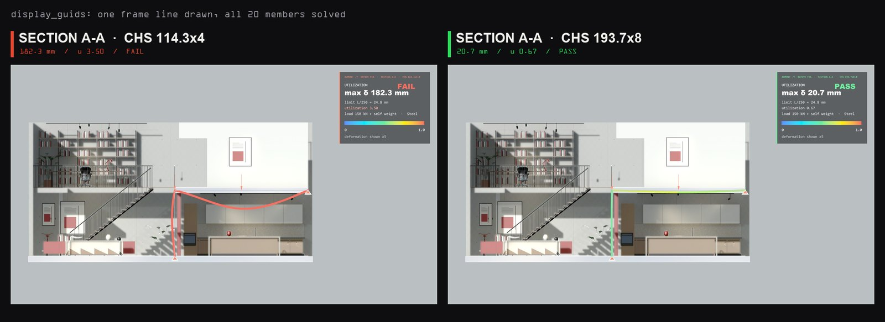
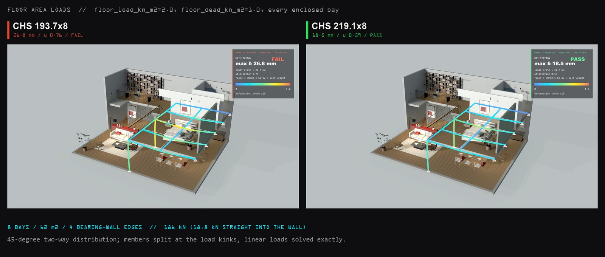
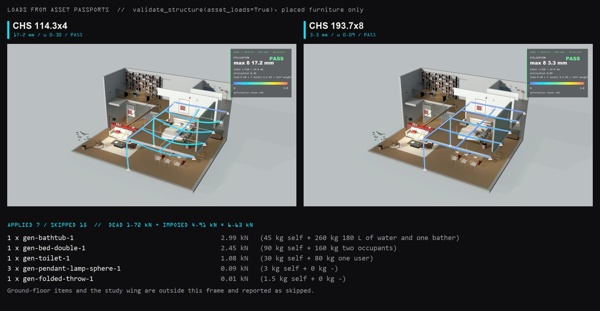

# Native frame solver

`validate_structure` analyses line models (beams, columns, trusses, frames) with
Almond's own 3D frame solver by default. Users no longer need Karamba3D for these;
Karamba remains available for shells and as a cross-check.

| | Native (`engine="auto"` / `"native"`) | Karamba (`engine="karamba"`) |
| --- | --- | --- |
| Install | nothing beyond almond-mcp + almondbridge | Karamba3D 3.1 licence (trial: 20 members) |
| Elements | straight beams (axial, torsion, biaxial bending), truss bars | beams, shells |
| Solve time, 20-member frame | ~13 ms (+ ~160 ms model export) | ~1.5 s |
| `visualize_structure` round trip | ~0.4–0.6 s (export, solve, draw) | ~1.2 s |
| `analysis_method` | `"native"` | `"api"` / `"template"` / `"rule_based"` |

*Rhino 8 with Grasshopper/Karamba never loaded (command line: "Karamba assemblies
loaded: 0"); the Atelier-07 mezzanine frame solved by the native engine and drawn by
the bridge's overlay.*

## Live view

`visualize_structure` uses the same engines: the server exports the model
(`structure_model`), solves it with `frame_solver`, and sends the solved field to the
bridge (`structure_draw`), which draws it with the same overlay as the Karamba route —
deformed shape coloured by displacement or utilization, supports, loads and a
PASS/FAIL legend. Display-only updates (`reanalyze=False`: scale, colouring, reveal,
physics on/off, `display_guids`) resend no geometry.

Stills: `examples/almond_promo/native_doc_capture.py` (drives the real tool code
against Rhino) and `native_doc_compose.py`.

`engine="auto"` routes to Karamba when the structure type is shell, gridshell or
membrane, when the selection contains shells, or when the installed bridge cannot
export a structural model (older than this change); the result then carries a
warning saying why.

## Method

- Direct stiffness method, Euler-Bernoulli beams, 6 DOF per node, rigid joints
  (`almond_mcp/frame_solver.py`, numpy only, written from the textbook method).
- Uniform and linearly varying member loads (self weight, floor-load triangles and
  trapezoids) are exact within each member: consistent fixed-end forces, Hermite
  interpolation of the end displacements plus the fixed-fixed particular solution
  `v = x²(L−x)²[w_a(3L−x) + w_b(x+2L)] / 120EIL`, so one element per member gives the
  exact deflected shape and moment diagram.
- Linear elastic, first order, static. Singular systems are reported as a
  **mechanism** with the nodes involved, never solved silently.
- Rotations at nodes that only truss bars meet are restrained automatically and
  reported (they carry no load).

## Modelling conventions (same as the Karamba path)

The bridge's `structure_model` message exports the conditioned geometry used by the
Karamba path: welded nodes, members split at intersections, inferred sections, curved
axes polygonized identically. `almond_mcp/native_structure.py` then applies:

- **Supports:** declared Rhino points (snapped to the nearest node within 50 mm), else
  every lowest-Z node. `fixed_supports=False` pins them (translations only).
- **Loads:** `load_kn` shared equally by the free nodes, acting downward; self weight
  γ·A along every member unless `self_weight=False`.
- **Deflection limit:** span/250. Span = longest member for beam/frame, else overall
  extent; `span_m` overrides it when members are split at every node (a 6.2 m joist
  drawn as two 3.1 m segments).
- **Member check (EN 1993-1-1, simplified):** cross-section interaction 6.2.1(7)
  `|N|/N_Rd + |M_y|/M_y,Rd + |M_z|/M_z,Rd` (CHS: resultant moment) with **elastic**
  moduli by default (conservative, the same basis as the Karamba check); flexural
  buckling 6.3.1 with L_cr = member length and the section's buckling curve, combined
  linearly with bending. γ_M0 = γ_M1 = 1.0.

**Not covered:** shells, second-order/P-Δ, lateral-torsional buckling (hollow sections
are immune; I-sections are not checked for it), shear/torsion interaction, dynamics,
connections, national annexes. Results are a preliminary design check, not an
engineer's sign-off.

## Floor area loads

`validate_structure(..., floor_load_kn_m2=2.0, floor_dead_kn_m2=1.0)` (and the same on
`visualize_structure`) loads every floor bay of the frame:

- **Bays** are the areas enclosed by beams on one level (faces of the plan graph, found
  with a half-edge walk). A straight line between two adjacent supports with no beam
  along it is a **bearing wall**: bays close on it and its share goes straight into those
  supports (in the reactions, bending no member). Diagonals between supports that would
  cut an already closed bay are rejected.
- **Distribution:** rectangular bays use 45° lines from the corners — short edges carry a
  triangle, long edges a trapezoid; above 2:1 the bay spans one way onto its long edges.
  Other convex bays use a centroid fan (each edge a triangle peaking under the centroid).
- **Exact:** members are split at the load shape's kinks and each part carries a linear
  load, solved exactly (a triangle on a simple span reproduces `WL³/60EI` and `WL/6`).
- **Loads:** `floor_load_kn_m2` is the imposed (occupancy) load — e.g. 1.5–2.0 kN/m² for
  homes (EN 1991-1-1 category A) — and `floor_dead_kn_m2` the superimposed dead load
  (build-up, finishes). Set `load_kn=0` so the generic node load does not double count.

Live, Atelier-07 mezzanine (2026-10-01): 8 bays, 62 m², 4 bearing-wall edges on the
east wall; 2.0 + 1.0 kN/m² gives 186 kN (18.75 kN straight into the wall), reactions
192.2 kN with self weight. CHS 193.7×8 — which passed the earlier simplified 150 kN node
load — now fails at 26.8 mm against L/250 = 24.8 mm; the lightest passing tube is
CHS 219.1×8 (18.5 mm, utilization 0.59).

## Loads from placed assets

`validate_structure(..., asset_loads=True)` and `visualize_structure(..., asset_loads=True)`
add the gravity load of every placed library asset that stands on (or hangs from) the
frame:

- **Load data:** `GeneratedAssetfiles/structural-loads.json` gives each of the 50 library
  assets an estimated self weight (dead) and in-use load (imposed: occupants at 80 kg,
  water in a filled bath, books on shelves), with category defaults for other libraries.
  These are typical-product estimates, not measured or manufacturer data. The entry is
  also returned by `get_generated_asset_passport` as `structural_loads`.
- **Placements:** Rhino objects tagged with an Almond asset id (`Almond.AssetId`,
  `almond:asset_id`) via the bridge's `asset_placements` message, or the scene ledger
  when `scene_id` is given.
- **Load path:** floor items load the highest frame level up to 1.6 m below their base (a
  lamp on a desk still loads the floor); ceiling items hang from the lowest level up to
  1.5 m above their top. The load goes to the nearest member, or is shared by the lever
  rule between the two parallel members either side (a floor spanning one way between
  them). Members are split at the load points, so point loads are exact.
- **Not applied, and reported why:** wall-mounted items, ground-only items (trees, cars,
  street furniture), structural elements, assets outside the frame's plan, and assets
  with no frame level below.
- **Sizes:** the load is the nominal product's. A placement whose plan size differs from
  the catalogue product by more than 1.5× (or less than 0.67×) is flagged, not rescaled:
  Almond's placement scale usually corrects generated-mesh proportions.

**Asset loads and floor loads.** A code imposed floor load (`floor_load_kn_m2`, e.g.
EN 1991-1-1 category A, 1.5–2.0 kN/m²) already covers movable furniture and people. Use
asset loads to check heavy, specific items (a filled bath, full bookshelves, a kitchen
island) on top of the floor load — accepting some double counting as conservative — or
on their own with the superimposed dead load as a furniture check.

Live, Atelier-07 mezzanine (2026-10-01): 7 placed assets on the frame — bathtub
(45 kg + 260 kg water and bather), bed (90 + 160 kg), toilet, a throw and three pendants
hung beneath — total 6.6 kN; 15 placements reported as skipped (ground floor, study wing).
CHS 114.3×4 under furniture and self weight only: 17.2 mm, utilization 0.30.

## Benchmarks

Asserted in `tests/test_frame_solver.py` (20 closed-form cases including equilibrium,
superposition, orientation invariance, mechanisms, section properties and EN 1993
buckling) and `tests/test_native_structure.py` (Karamba cross-check). Regenerate the
tables with `uv run python tools/run_structural_benchmarks.py`.

### Closed form (CHS 114.3×4, S235)

| Case | Closed form | Exact (mm) | Native (mm) | Error |
| --- | --- | ---: | ---: | ---: |
| Cantilever, tip load 10 kN, 3 m | PL³/3EI | 203.0514 | 203.0514 | 0.0e+00 |
| Cantilever, UDL 5 kN/m, 4 m (1 element) | wL⁴/8EI | 360.9803 | 360.9803 | 1.1e-16 |
| Simply supported, UDL 8 kN/m, 6 m | 5wL⁴/384EI | 304.5771 | 304.5771 | 6.7e-16 |
| Simply supported, midspan 12 kN, 5 m | PL³/48EI | 70.5040 | 70.5040 | 7.8e-16 |
| Fixed-fixed, UDL 6 kN/m, 5 m | wL⁴/384EI | 22.0325 | 22.0325 | 1.1e-16 |
| Two-bar truss, apex 20 kN | PL/2EA·sin²α | 0.2386 | 0.2386 | 2.2e-16 |

### Karamba3D cross-check

Reference runs: Karamba3D 3.1 (karambaCommon 3.1.60921) in Rhino 8, 2026-09-30, on the
same geometry and conventions (`tests/data/karamba_reference.json`).

| Model | Section | Load (kN) | Karamba δ (mm) | Native δ (mm) | Δ | Karamba u | Native u | Δ |
| --- | --- | ---: | ---: | ---: | ---: | ---: | ---: | ---: |
| portal_cantilever | CHS 114.3×4 | 10 | 110.45 | 110.15 | -0.3% | 1.209 | 1.209 | +0.0% |
| mezzanine | CHS 114.3×4 | 150 | 183.01 | 182.32 | -0.4% | 3.588 | 3.501 | -2.4% |
| mezzanine | CHS 139.7×5 | 150 | 82.05 | 81.59 | -0.6% | 1.910 | 1.911 | +0.1% |
| mezzanine | CHS 168.3×6.3 | 150 | 38.56 | 38.25 | -0.8% | 1.072 | 1.076 | +0.4% |
| mezzanine | CHS 193.7×8 | 150 | 20.92 | 20.71 | -1.0% | 0.664 | 0.668 | +0.5% |
| mezzanine | CHS 219.1×8 | 150 | 14.52 | 14.33 | -1.3% | 0.519 | 0.522 | +0.5% |
| mezzanine | CHS 114.3×4 | 0.001 | 6.20 | 6.19 | -0.2% | 0.106 | 0.107 | +0.7% |
| mezzanine | CHS 114.3×4 | 50 | 65.11 | 64.87 | -0.4% | 1.235 | 1.238 | +0.3% |
| mezzanine | CHS 114.3×4 | 100 | 124.06 | 123.59 | -0.4% | 2.375 | 2.370 | -0.2% |

The deflection gap grows slightly with stockier sections: Karamba uses Timoshenko
beams (shear deformation), the native solver Euler-Bernoulli. Bending-governed members
match Karamba's utilization within 1 %; compression members can differ by up to ~11 %
(EN 1993 6.3 linear interaction here, Karamba's own interaction factors there).

Live check (2026-10-01): the mezzanine exported from Rhino through `structure_model`
gave native 182.31 mm / u 3.50 vs Karamba `validate` 182.53 mm / u 3.59 (CHS 114.3×4),
and 20.70 mm / 0.668 vs 20.85 mm / 0.664 (CHS 193.7×8), same verdicts.
