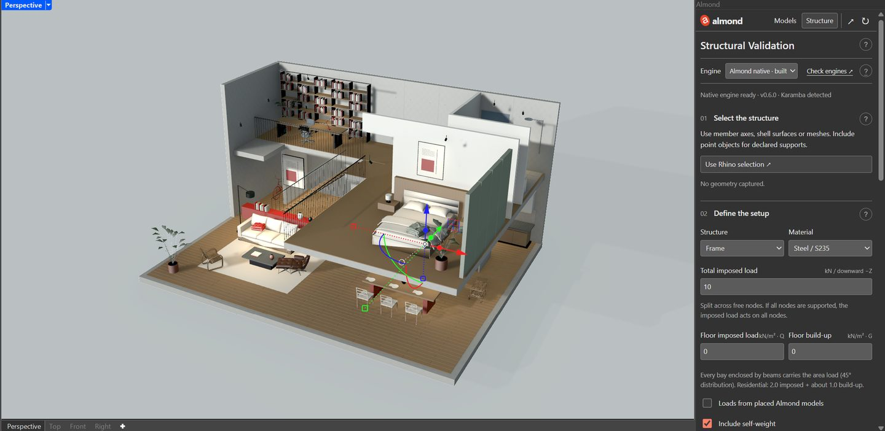
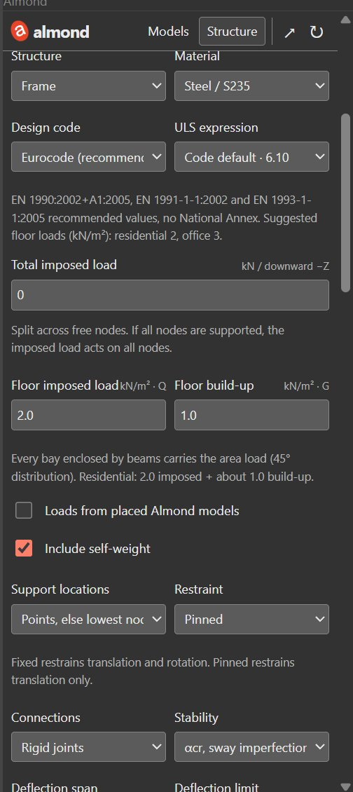
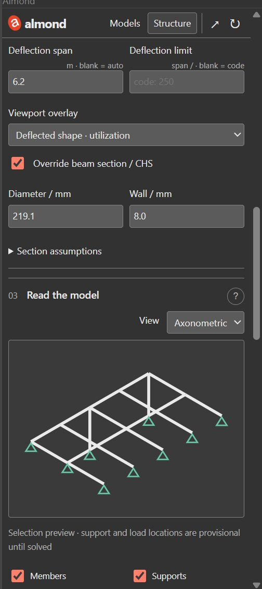
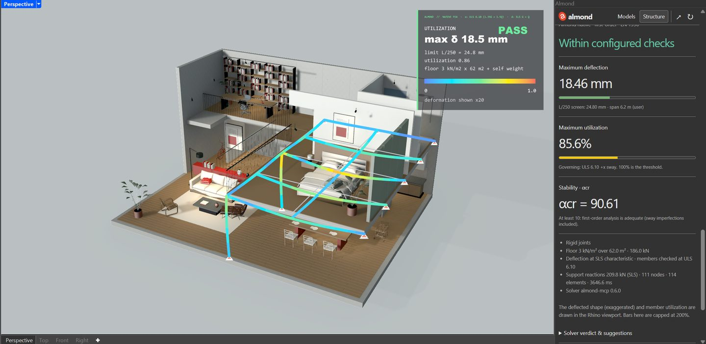
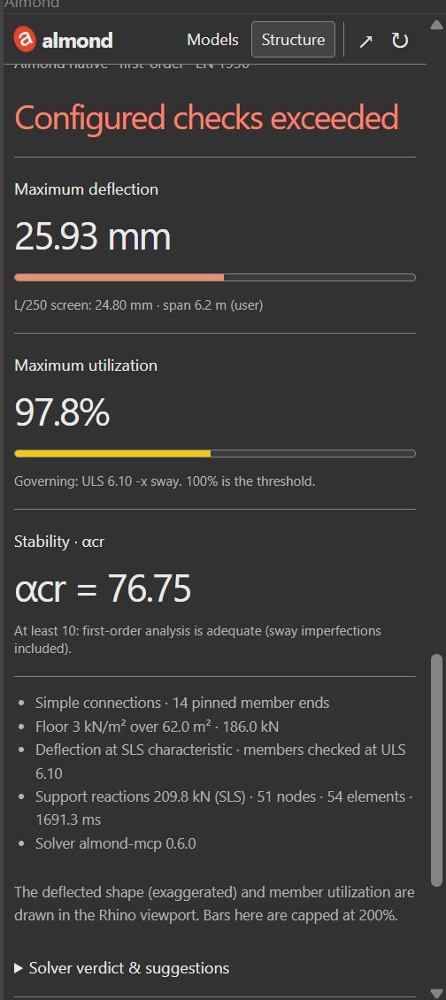
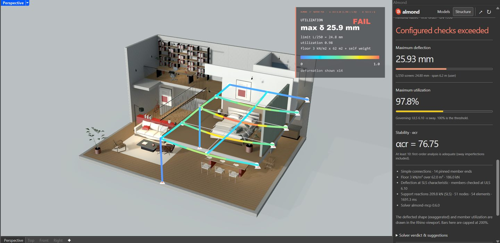
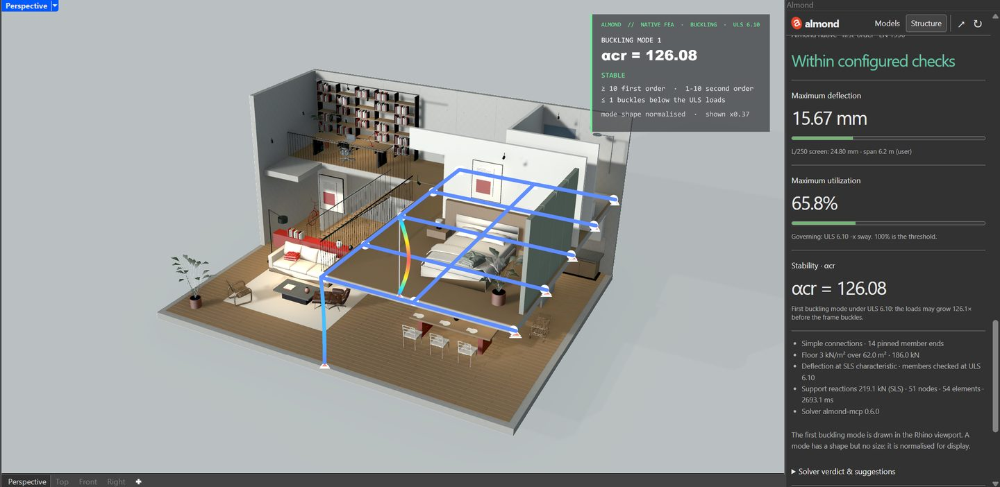
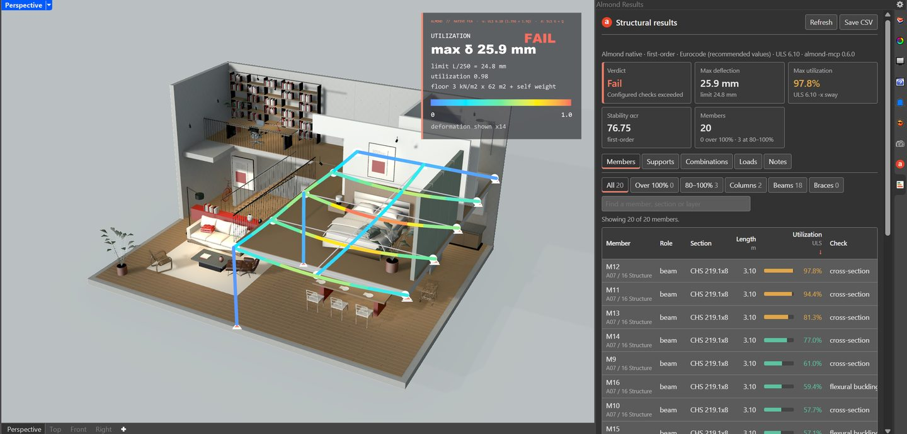
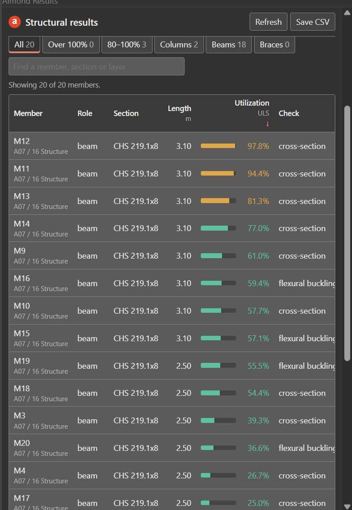
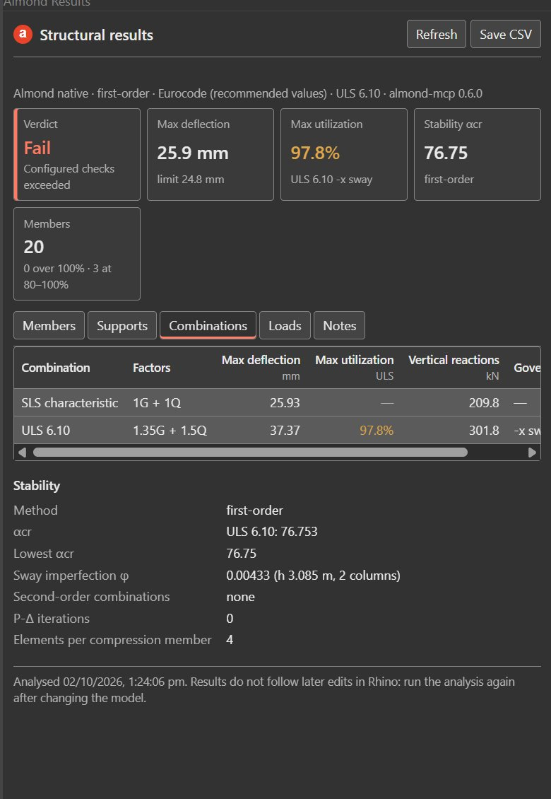

# Almond in Rhino: the Structure workspace

This tutorial shows how to check a structure inside Rhino 8 with Almond. You draw the frame, set the loads, run the analysis, and read where it bends, how hard each member works and whether it could buckle. Change a size and check again in seconds.

It covers the Rhino panel. Every step can also be driven by Claude or another MCP client (see [Use it from Claude](#use-it-from-claude)).

**Time for a first check:** about five minutes.
**Engine:** built in. Karamba3D is optional and needs its own licence.
**Basis:** EN 1990 load combinations and EN 1993-1-1 steel member checks, with the Eurocode recommended values by default (see [Design codes](design-codes.md)).

The screenshots show the A07 apartment mezzanine from the generated model library.

---

## 0. Install

1. In Rhino 8, run `_PackageManager`, search **almondbridge** and install it. For a pre-release, tick **Include pre-releases** first.
2. Install uv once: `winget install astral-sh.uv`. The panel's native engine runs through it, as the MCP server does.
3. Restart Rhino.

The [Rhino quickstart](rhino-archive-quickstart.md) has the full install, including the optional MCP setup for Claude.

## 1. Draw the structure as lines

Almond analyses **centre lines**: one curve for each beam and each column, meeting at the joints. Keep them on their own layer.

| What you draw | What Almond does with it |
|---|---|
| Curves (lines, polylines, arcs) | Members. Crossing curves are split at every crossing, so a continuous arch or beam drawn as one curve becomes several members. |
| Rhino **point** objects | Supports. Without points, the lowest nodes become the supports. |
| Thin solids, surfaces, meshes | Shells (Karamba3D only). |
| Prismatic solids (columns and beams drawn as boxes or extrusions, at least 3× longer than wide) | Their centre line, with a solid rectangular section taken from the solid. |
| Any other solid (a truss modelled with its openings, a block) | Skipped, with a warning. Draw its centre lines instead. |

**Sections.** A curve gets the section inferred from its geometry, or the default steel tube CHS 114.3 × 4. To set it yourself, give the curve a user text (Properties ▸ Attribute User Text):

| Key | Value | Example |
|---|---|---|
| `almond:section` | `rect W x D`, `box W x D x t` or `chs D x t`, in mm unless a unit follows | `rect 300x640`, `rect 30x64 cm`, `chs 219.1x8` |
| `almond:release` | `pinned`, `pinned_start`, `pinned_end` or `rigid` | `pinned` for a simply supported beam |

The panel's **Override beam section** sets one tube size for every member and takes precedence over both.

**Size limit.** One study takes at most **200 selected objects**. For a big frame, draw arches, ties and beam lines as continuous curves rather than one curve per segment. For example, a 32 m concrete hall drawn as 84 continuous curves became 217 members.

## 2. Open the Structure workspace

Type `AlmondStructure` in Rhino's command line, or run `Almond` and click **Structure**. The panel opens beside the viewport and checks its engines. Wait for **Native engine ready** under the engine choice.

Leave **Engine** on **Almond native · built in**. Choose Karamba3D only for shells and surfaces.

## 3. Capture the frame

1. Select the structural curves in Rhino, plus any support points.
2. Click **Use Rhino selection ↗**.

The panel confirms what it took, for example `29 objects · 20 beams · 0 shells · Millimeters`, and draws a small diagram of the frame under **Read the model**. If you edit the geometry later, capture it again: results never follow later edits.

## 4. Set the code, loads and joints

Work down the setup. These values are a sensible start for a home.

| Setting | Start with | What it means |
|---|---|---|
| Structure | Frame | *Beam* for a single member, *Truss assembly* for trusses. |
| Material | Steel / S235 | S355, Concrete C30/37, Wood C24 and Aluminium are also listed. Concrete, timber and aluminium give **indicative** results (see [Limits](#7-know-the-limits)). |
| Design code | Eurocode (recommended values) | The safety factors and limits. *Off* runs plain mechanics without them, for comparisons only. National Annex profiles you add appear here too. |
| ULS expression | Code default | How the factors combine loads (6.10, or 6.10a/6.10b). |
| Total imposed load | 0 kN | One extra load shared over the free nodes. Use 0 when you give floor loads. |
| Floor imposed load | 2.0 kN/m² | People and furniture (Q). The panel suggests values for the chosen code. |
| Floor build-up | 1.0 kN/m² | The floor's own weight: screed, boards, tiles (G). |
| Loads from placed Almond models | Off | Adds the real weight of placed library items, such as a filled bath. |
| Include self-weight | On | The members' own weight. |
| Support locations, Restraint | Points, else lowest nodes; Pinned | Pinned is the cautious choice. *Fixed* also restrains rotation. |
| Connections | Rigid joints | *Simple · pinned beam ends* for typical bolted steel or timber. It is stricter and closer to how they behave. |
| Stability | αcr, sway imperfection, P-Δ | Checks whether the frame could buckle, and switches to second-order analysis when αcr is below 10. |
| Deflection span, limit | Blank | Blank takes the longest member and the code's limit (span/250). Type the real span when beams are drawn in pieces. |
| Viewport overlay | Deflected shape · utilization | Or *First buckling mode*. |
| Steel tubes | Cold-formed · EN 10219 | How the tubes are made, which sets the buckling curve: cold-formed uses curve c, hot-finished curve a. |
| Override beam section / CHS | Off, or e.g. 219.1 × 8 | One tube for every member, in mm. |

 

## 5. Run and read

Click **Run native analysis ↗**. After a few seconds (the very first run downloads the engine and takes longer):

- **In the viewport**, the frame is drawn bent, exaggerated so you can see it, and coloured by how hard each member works: blue is comfortable, yellow is close, red is overloaded. A card at the top shows the verdict.
- **In the panel**, the results appear.

| Result | How to read it |
|---|---|
| Verdict | *Within configured checks* (green), *Configured checks exceeded* (red), or *Indicative only* (amber) for concrete, timber and aluminium. |
| Maximum deflection | How far the structure sags, against the limit; L/250 means the span divided by 250. |
| Maximum utilization | How hard the weakest member works. Under 100% passes. Steel members are checked to EN 1993-1-1: cross-section, flexural buckling with the Annex B interaction factors, and the section class. |
| Stability · αcr | How many times the loads could grow before the frame buckles. Above 10 is comfortable; between 1 and 10 the analysis turns second-order on its own; 1 or less is unstable and fails. |
| Facts, warnings | The code, loads, joints and solver that were used. Read the warnings before trusting a pass. |

Under the results:
- **Select worst members** highlights the weakest members in Rhino.
- **Save analysis JSON** keeps a record of the run: inputs, settings, geometry snapshot, warnings and timestamp.
- **Open full results ↗** opens the Results panel (step 6).
- **Clear viewport overlay** removes the drawing.

**Iterate.** After any change, the panel marks the old results *rerun required*. Change one thing and run again. For example, on the A07 mezzanine, switching the joints to *Simple* turns a pass into a fail, and one tube size up passes again. Set the overlay to *First buckling mode* to see the shape it would buckle into.

 

## 6. Every member: the Results panel

Click **Open full results ↗**, or type `AlmondResults`. The **Almond Results** panel opens as a tab beside the Almond panel and refreshes after every run. Both panels have their own icon in Rhino's panel strip: the red **a** for Almond, and the sheet with three bars for Almond Results.

| Tab | What it lists |
|---|---|
| Members | Every member's role, section, Class (EN 1993 Table 5.2), length and utilization, with the check and combination that govern. Also its forces (N, V, M, T), stress, slenderness λ̄ and χ, buckling length, the 6.61/6.62 terms, its own sag and L/δ, and its end releases. |
| Supports | The reactions at each support (Fx, Fy, Fz, Mx, My, Mz) for the combination you pick, with totals. |
| Combinations | Each combination's factors, largest deflection and utilization, and the stability details: αcr, sway imperfection, P-Δ iterations. |
| Loads | The settings used, the floor bays, and every placed model counted as a load. |
| Notes | The verdict, suggestions, warnings and assumptions. |

- **Sort** by clicking a column heading. The table opens with the hardest-working member first.
- **Filter** with the chips (*Over 100%*, *80–100%*, *Columns*, *Beams*, *Braces*) or type a member name, section or layer.
- **Click a row** to select that member in Rhino.
- **Save CSV** writes the member table for a spreadsheet or calculation report.

 

## 7. Know the limits

- **A design-stage tool.** It sizes and compares options early. It does not replace a structural engineer's design and sign-off.
- **Steel is the checked case.** Concrete, timber and aluminium are **indicative**: forces, deflection and stability are computed, but their own codes (EN 1992, EN 1995, EN 1999) are not applied, so there is no capacity pass/fail. Excess deflection and instability still fail.
- **Gravity loads only.** Self-weight, floors, people, placed items, and the code's sway imperfection. Wind is not checked yet. Snow is entered by you as an area or total load.
- **Not yet covered:** member bow imperfections (EN 1993 5.3.2(6)), the shear check 6.2.6, and Class 4 (slender) sections, which fail as "not covered" rather than pass unchecked.
- **National Annexes.** Only the Eurocode recommended values ship. A practice can add its country's annex as a profile file (`%LOCALAPPDATA%\Almond\design-codes`); unchecked values are flagged. See [Design codes](design-codes.md).

## 8. Use it from Claude

With the MCP server registered (`uvx almond-mcp`), Claude can run the same engine on the objects you name or select:

- `validate_structure`: solve and check. Pass `detail=True` for the per-member and per-support tables. `design_code`, `fabrication`, `floor_load_kn_m2` and `asset_loads` match the panel settings.
- `visualize_structure`: draw the deflected shape or a buckling mode (`view="buckling"`) in the viewport.

A typical request: *"Check the frame on layer Structure with 2 kN/m² imposed and 1 kN/m² build-up, simple joints. If it fails, find the lightest CHS that passes."*

## 9. Troubleshooting

| You see | Do this |
|---|---|
| Native engine unavailable | Install uv (`winget install astral-sh.uv`), restart Rhino, then click **Check engines**. The first run downloads the engine. |
| Nothing captured | The structural layer is probably hidden. Show it, select the curves, and capture again. |
| "Select at most 200 structural objects per study" | Join segments into continuous curves (step 1), or check part of the structure. |
| "The model changed" | You edited the geometry after capturing. Click **Use Rhino selection** again. |
| Unstable or mechanism | Part of the frame can swing freely. Add supports, choose fixed restraints, or use rigid joints. |
| Solid skipped | It is neither a prismatic member nor a thin plate. Draw its centre lines. |
| A shell will not run | The native engine checks line members. Switch the engine to Karamba3D. |
| A section looks wrong | Check the curve's `almond:section` text; an unreadable value is listed under warnings and the default is used instead. |
